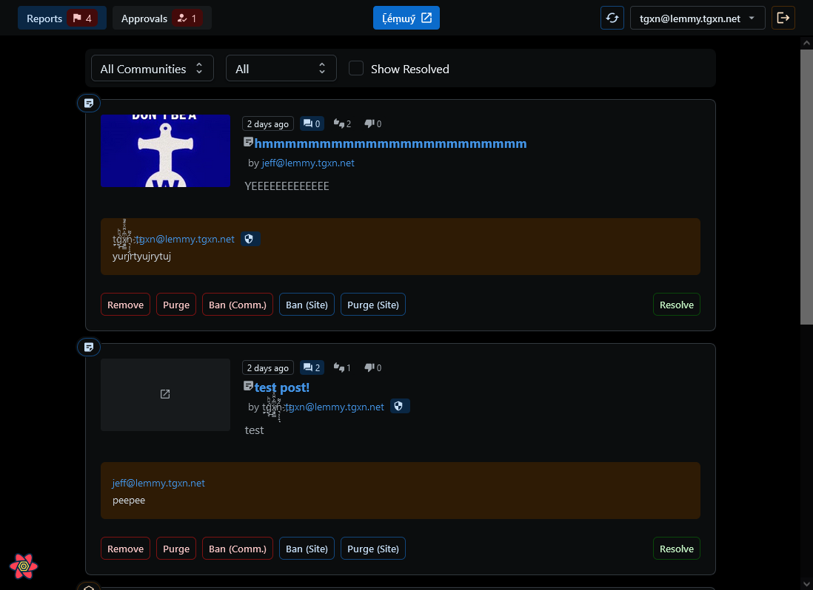
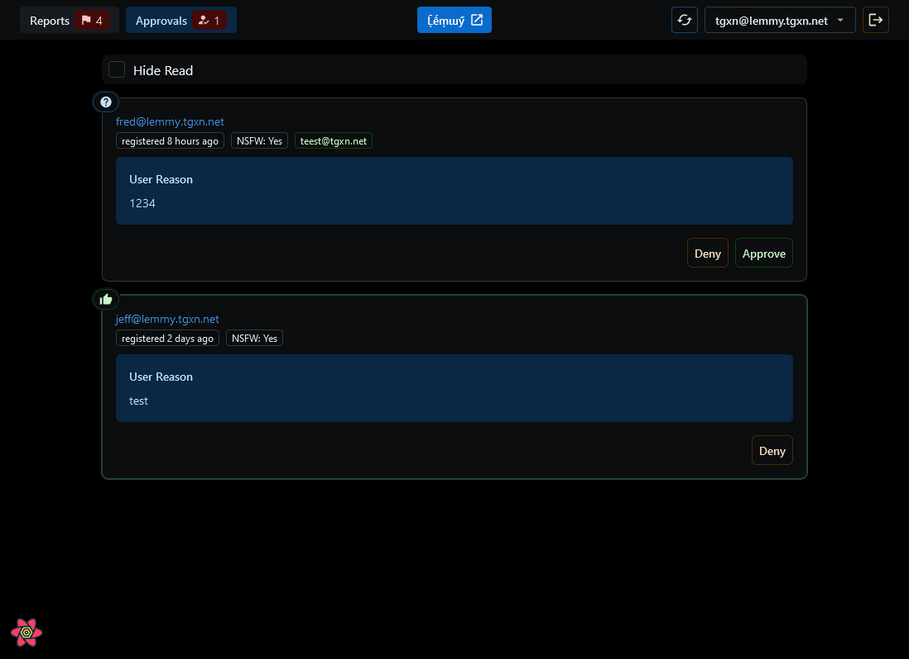

# Lemmy Modder
# https://modder.lemmyverse.net/ 

A Lemmy moderation tool for community moderators and site admins, but on steroids. ⚡

 > Currently, only compatible with 0.18.x instances, as Lemmy SDK is not backwards-compatible. :'(

## Features:
- Quick Actions 
    - Resolve/Unresolve Reports
    - Remove/Restore/Purge Posts & Comments
    - Ban/Unban Users (from Community or Site)
    - Lock/Unlock Posts
- Quick Switch Accounts
- Approval Managmenent
    - Approve/Reject Registration Applications
    - See more user data when making decision, join date, email, etc.
- View Mod Log
    - See all actions taken by mods on the instance
    - Filter by local instance actions
    

## Screenshots
| | |
| --- | --- | 
|  |    |

## Dev Running

Frontend: `npm i && npm start`

# todo implement

 > ticked when i added the button functionality :)

# "resolve"/"unresolve" reports
- ✅ https://join-lemmy.org/api/classes/LemmyHttp.html#resolvePostReport
- ✅ https://join-lemmy.org/api/classes/LemmyHttp.html#resolveCommentReport
- ✅ https://join-lemmy.org/api/classes/LemmyHttp.html#resolvePrivateMessageReport

# delete content
- ✅ https://join-lemmy.org/api/classes/LemmyHttp.html#removePost
- ✅ https://join-lemmy.org/api/classes/LemmyHttp.html#removeComment

# purge content
- ✅ https://join-lemmy.org/api/classes/LemmyHttp.html#purgePost
- ✅ https://join-lemmy.org/api/classes/LemmyHttp.html#purgeComment
- ✅ https://join-lemmy.org/api/classes/LemmyHttp.html#purgePerson

# get / ban users
- https://join-lemmy.org/api/classes/LemmyHttp.html#getBannedPersons
- ✅ https://join-lemmy.org/api/classes/LemmyHttp.html#banFromCommunity
- ✅ https://join-lemmy.org/api/classes/LemmyHttp.html#banPerson

# lock / comment / distinguish
- https://join-lemmy.org/api/classes/LemmyHttp.html#lockPost
- https://join-lemmy.org/api/classes/LemmyHttp.html#createComment
- https://join-lemmy.org/api/classes/LemmyHttp.html#distinguishComment

# manage community mods
- https://join-lemmy.org/api/classes/LemmyHttp.html#addModToCommunity
- ✅ https://join-lemmy.org/api/classes/LemmyHttp.html#getUnreadRegistrationApplicationCount
- ✅ https://join-lemmy.org/api/classes/LemmyHttp.html#listRegistrationApplications
- ✅ https://join-lemmy.org/api/classes/LemmyHttp.html#approveRegistrationApplication

- ✅ https://join-lemmy.org/api/classes/LemmyHttp.html#getModlog

# Credits

Logo made by Andy Cuccaro (@andycuccaro) under the CC-BY-SA 4.0 license.

