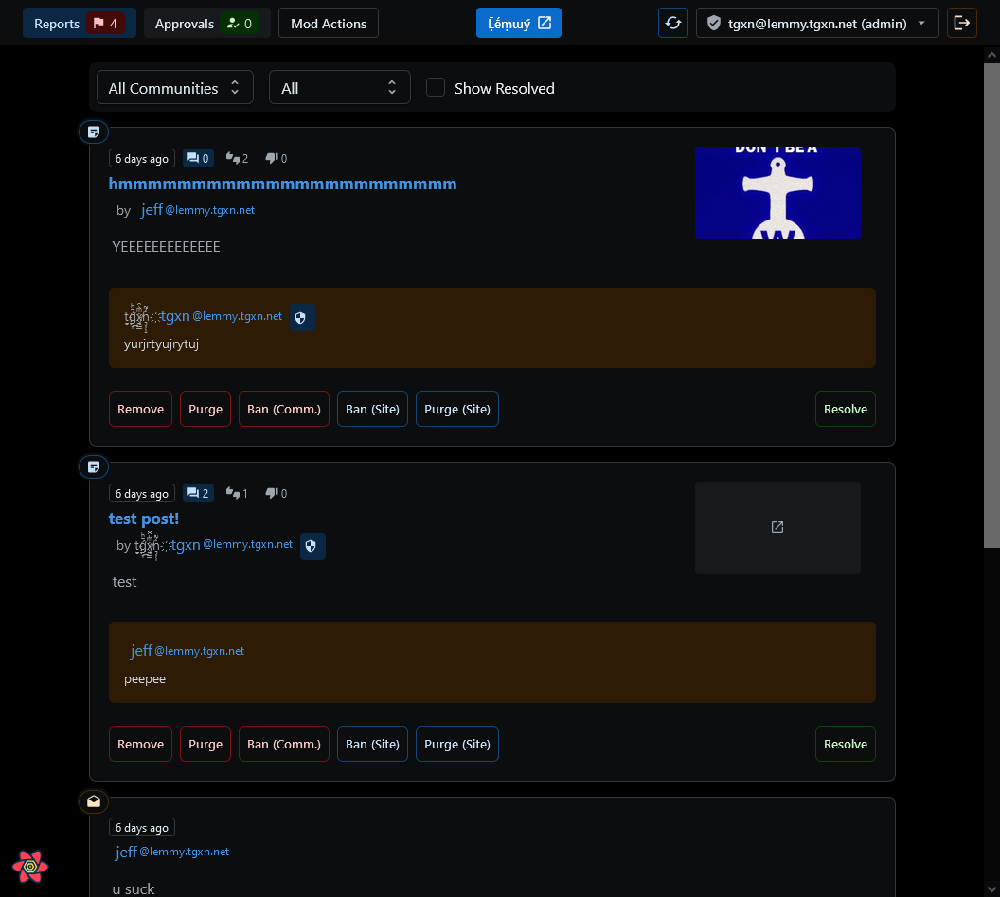
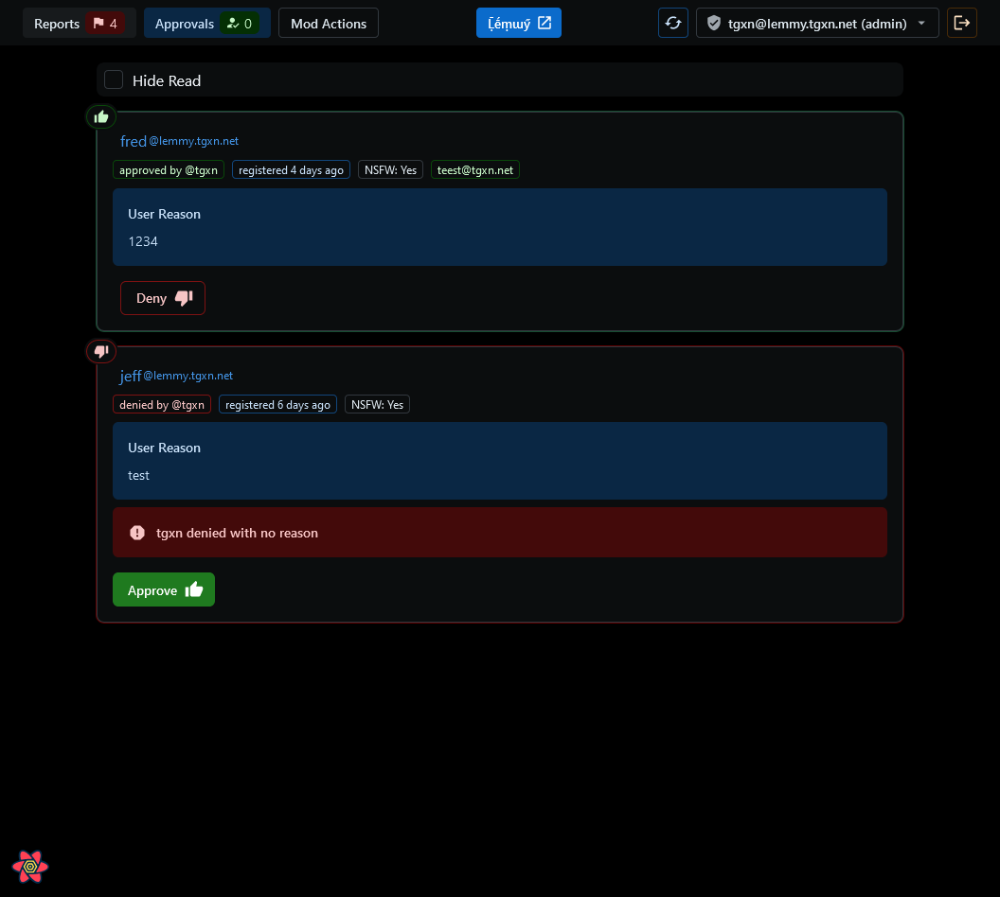
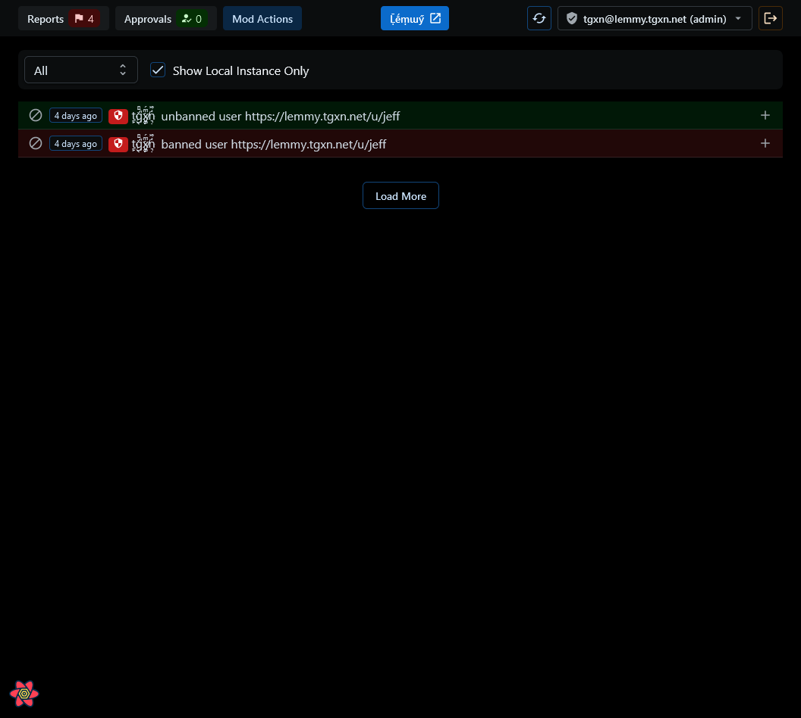

[](https://github.com/tgxn/lemmy-modder/actions/workflows/publish-pages-main.yaml)

# Lemmy Modder https://modder.lemmyverse.net/ 

⚡ A moderation tool for [Lemmy](https://github.com/LemmyNet/lemmy) community moderators and site admins. ⚡

 > Currently only compatible with 0.18.x instances _(and not 0.19.x)_, as the [Lemmy SDK is not backwards-compatible.](https://github.com/LemmyNet/lemmy-js-client/issues/194) ☹

## Screenshots
| | | |
| --- | --- | --- |
|  |  |  |

## Features
- **Does not save, proxy or store any of your user credentials or data**
  - Data is stored in your browsers [`localStorage`](https://developer.mozilla.org/en-US/docs/Web/API/Window/localStorage) and is only sent to your Lemmy instance.
- User Registration Panel
    - Improved user registrations experience
    - More user data when making decision, join date, email, etc.
- Content Reports
    - Resolve/Unresolve Reports
    - Remove/Restore/Purge Posts & Comments
    - Ban/Unban Users (from Community or Site)
    - Lock/Unlock Posts
- View Mod Log
    - See all actions taken by mods on the instance
    - Filter by local instance actions
- Quick Switch Accounts on different Lemmy instances


## Hosting Options

You can either use the hosted option at https://modder.lemmyverse.net/ or host your own instance.

### Running Own Instance with Docker Compose

You will need docker & docker-compose installed on your server.


1. Add this (service) to your docker-compose alongside the lemmy services, or wherever you like:
```yaml
## ... your networks and volumes from lemmy should stay here
services:
  ## ... your other lemmy services should stay here

  ## this is the lemmy modder container, you can change port 9696 to wehatever you like
  lemmy-modder:
    image: ghcr.io/tgxn/lemmy-modder:latest
    restart: unless-stopped
    ports:
      - 9696:80
```
2. Bring up the new container `docker-compose up -d lemmy-modder`
3. Setup your reverse proxy to proxy requests for `modder.example.com` to the new container on port `80`.

If you use Traefik, the labels will be something like this:
```yaml
    networks:
      - traefik-net
    labels:
      - "traefik.enable=true"
      - "traefik.docker.network=traefik-net"
      - "traefik.http.services.lemmy_mod.loadbalancer.server.port=80"

      # internet https
      - "traefik.http.routers.lemmy_mod_https_net.rule=Host(`modder.example.com`)"
      - "traefik.http.routers.lemmy_mod_https_net.entrypoints=https"
      - "traefik.http.routers.lemmy_mod_https_net.tls.certResolver=SSL_RESOLVER"

      # internet http redirect
      - "traefik.http.routers.lemmy_mod_http_redirect_net.rule=Host(`modder.example.com`)"
      - "traefik.http.routers.lemmy_mod_http_redirect_net.entrypoints=http"
      - "traefik.http.routers.lemmy_mod_http_redirect_net.middlewares=redirect_https@file"
```


_There are no more steps, as there is no users or databases._

## Development

### Setup Development Environment

Just make sure you have these tools installed:
- git
- nodejs & npm (use nvm to install `v18.17.0`)

#### Steps 

1. Clone this Github repo locally, and switch to the cloned directory
```
git clone https://github.com/tgxn/lemmy-modder.git && cd lemmy-modder
```
3. Install the Node Dependencies 
```
npm i
```
4. Start the dev server
```
npm start
```
5. Open http://localhost:9696 in your browser

# Credits

Lemmy  Devs https://github.com/LemmyNet

Logo made by Andy Cuccaro (@andycuccaro) under the CC-BY-SA 4.0 license.

