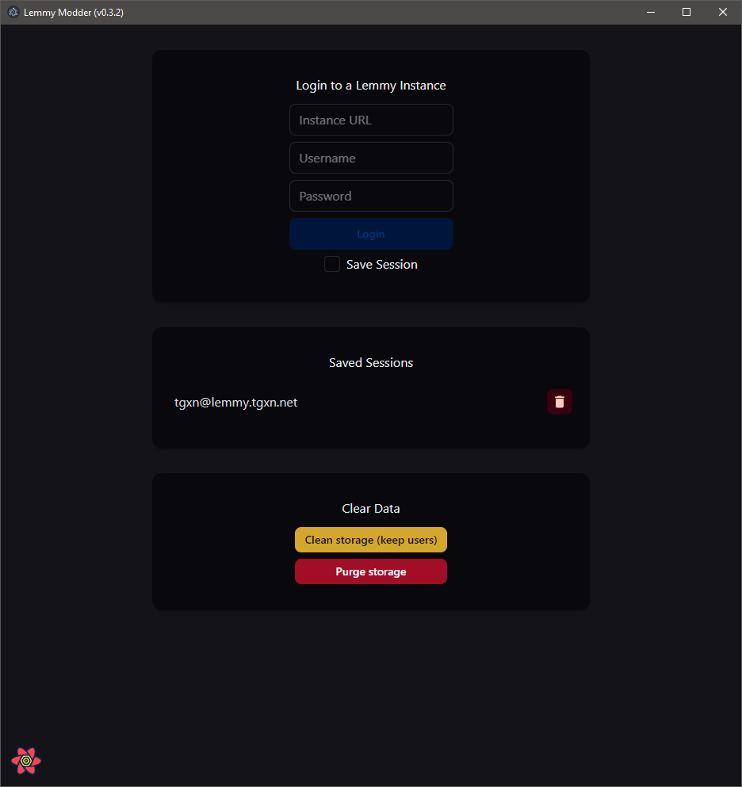
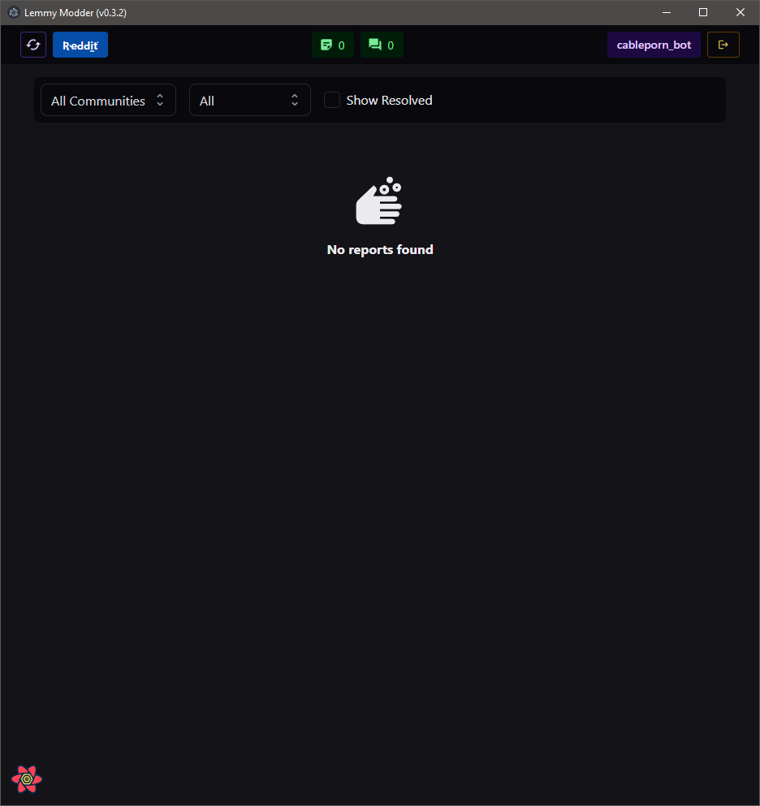
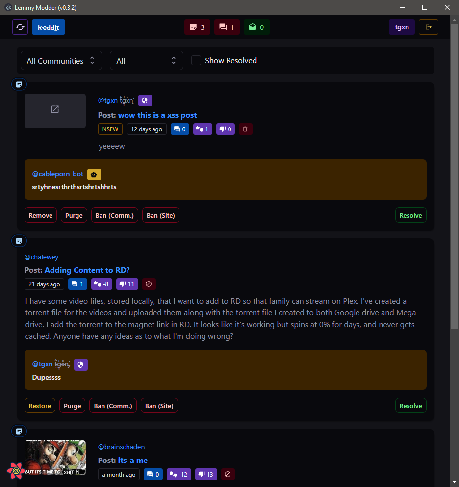

# Lemmy Modder

A Lemmy moderation tool for community moderators and site admins. Like the reports page, but on steroids. ⚡

## Features:
- Quick Actions 
    - Resolve/Unresolve Reports
    - Remove/Restore Posts & Comments
    - Ban/Unban Users (from Community or Site)
    - Lock/Unlock Posts

- Quick Switch Accounts
- Lemmy Instance Auto-Login in popups
- Auto-Update from GitHub

Coming Soon?
- View/Manage Community & Site-Wide Bans
- View/Manage Community Mods
- View Modlog
- Canned Messages
    - "Canned" Reply/Distinguish Comments
    - "Canned" Ban/Remove Reasons 

## Screenshots
| | | |
| --- | --- | --- |
|  |    |  |

You can use the portable version or the installer which can auto-update from GitHub. Check the latest release for the files.

----------------

Original Thinking etc. below

# mod lemmy ayyy

I'm thinking of building a quick and dirty electron app that can:
- integrate wiht lemmy api, get list of my modded communtiies
- dropdown "select communtiy" or "all"
- show a list of reports in specifc communities
- clear "take actions" buttons on each report
 - remove post
 - purge post
 - ignore report
- option to remove "ignore" reports that we dont wanna action

thinking methods

 - browser plugins - too much work/hard to manage thru ui upgrades/will break
 - website  - suffers issues with cors logins, could be possible in future
 - local app - can work currently, doesn't rely on server owners to install/update
 - backend container sits with lemmy instance - overhead to manage for admins, possibly better access to data from db

## Result 

Simple [Electron](http://electron.atom.io) application that loads a URL
passed on the command line in a windo

React frontend

## Dev Running

This is a hacky quick and dirty app, so running it is in beta

1. Frontend: `cd frontend && npm i && npm start`
2. App: `cd app && npm i && npm start`

The reason for the electron app is CORS on most lemmy instances returning invalid unless the origin header is overridden... which the electron app does.

# todo implement

 > ticked when i added the button functionality :)

# "resolve"/"unresolve" reports
- ✅ https://join-lemmy.org/api/classes/LemmyHttp.html#resolvePostReport
- ✅ https://join-lemmy.org/api/classes/LemmyHttp.html#resolveCommentReport
- ✅ https://join-lemmy.org/api/classes/LemmyHttp.html#resolvePrivateMessageReport

# delete content
- ✅ https://join-lemmy.org/api/classes/LemmyHttp.html#removePost
- ✅ https://join-lemmy.org/api/classes/LemmyHttp.html#removeComment

# purge content
- ✅ https://join-lemmy.org/api/classes/LemmyHttp.html#purgePost
- ✅ https://join-lemmy.org/api/classes/LemmyHttp.html#purgeComment
- https://join-lemmy.org/api/classes/LemmyHttp.html#purgePerson

# get / ban users
- https://join-lemmy.org/api/classes/LemmyHttp.html#getBannedPersons
- ✅ https://join-lemmy.org/api/classes/LemmyHttp.html#banFromCommunity
- ✅ https://join-lemmy.org/api/classes/LemmyHttp.html#banPerson

# lock / comment / distinguish
- https://join-lemmy.org/api/classes/LemmyHttp.html#lockPost
- https://join-lemmy.org/api/classes/LemmyHttp.html#createComment
- https://join-lemmy.org/api/classes/LemmyHttp.html#distinguishComment

# manage community mods
- https://join-lemmy.org/api/classes/LemmyHttp.html#addModToCommunity
- https://join-lemmy.org/api/classes/LemmyHttp.html#approveRegistrationApplication

- https://join-lemmy.org/api/classes/LemmyHttp.html#getModlog

# Credits

Logo made by Andy Cuccaro (@andycuccaro) under the CC-BY-SA 4.0 license.

